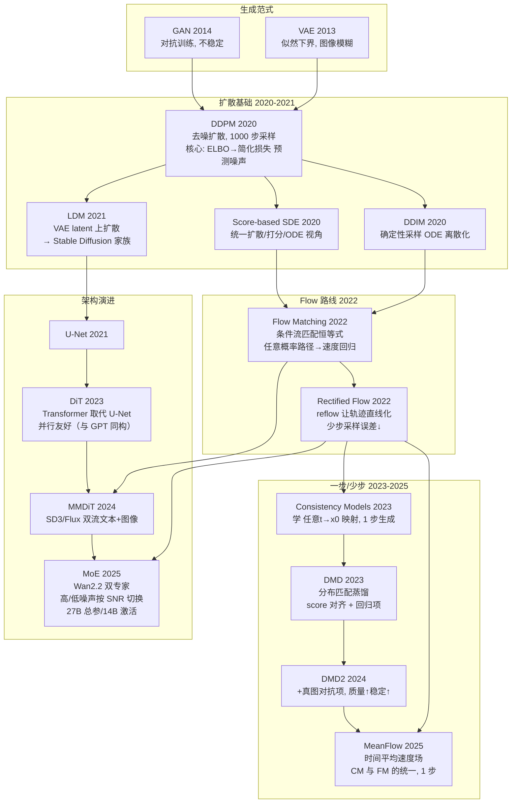
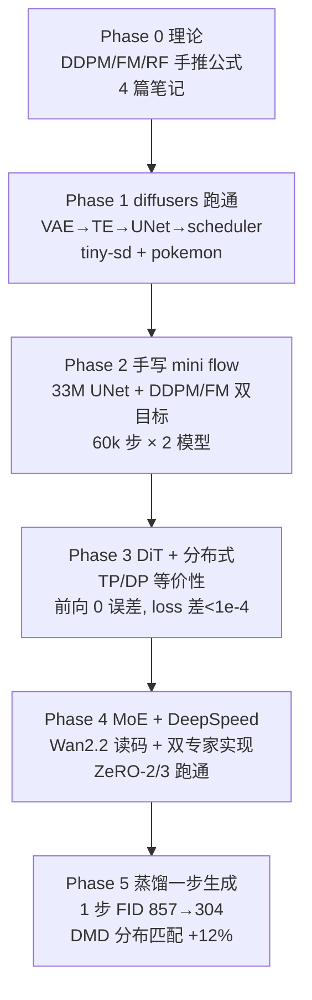

# 技术演进路线

两条线：**方法演进**（Diffusion 领域从 DDPM 到一步生成的路线，标注每个节点
解决什么问题）和**项目演进**（本仓库 Phase 0-5 的落地路径与量化结果）。

---

## 1. 方法演进（领域视角）



**读懂这张图的关键**：
- **Flow 路线**：FM 提出"预测速度场"，RF 让轨迹更直——
  这是 SD3/Flux/Wan 全部选择的主路线（少步采样）。
- **一步生成路线**：DMD 用分布匹配把多步 ODE 压缩成一步前向；
  MeanFlow（2025）从时间平均速度场出发统一 CM 与 FM。
- **架构线**：U-Net → DiT（并行友好）→ MMDiT（多模态）→ MoE（容量-成本解耦）。

---

## 2. 项目演进（本仓库 Phase 0-5 的落地）



### 关键量化结果（每条都对应一个可复现实验）

| Phase | 实验 | 结果 | 结论 |
|---|---|---|---|
| 2 | flow vs ddpm（60k 步, CIFAR-10） | 50 步 FID **54.4** vs 94.1 | flow 少步优势实证（16 步 77.9 < ddpm 50 步 94.1）|
| 2 | EMA 陷阱诊断 | EMA FID 727 vs raw 94.6 | decay 0.9999 在快速训练下有害，评估必须 raw/EMA 双测 |
| 3 | TP=2 数学等价性 | 前向 **0 误差**，100 步 loss 差 **~1e-4** | 自写 DiT TP 切分正确 |
| 4 | MoE vs dense（15k 步） | FID 114 vs **181** | 同激活参数下强行分流有害；MoE 价值在容量-成本解耦 |
| 5 | 蒸馏（回归 + DMD） | 1 步 FID 857→**304** | 把 50 步 ODE 算力编码进一步网络 |

---

## 3. 演进逻辑总结（为什么这条路这样走）

```
质量/延迟权衡这条主线：
  多步 ODE（50 步, FID 54）      ← 训练上限, 质量优先
    ↓ 蒸馏（Phase 5）
  1 步生成（FID 304）            ← 部署, 延迟优先
    ↓ 下一步（未做, 可扩展）
  对抗/更强蒸馏（DMD2 式）       ← 1 步质量逼近多步

并行/显存主线：
  单卡（Phase 2）→ TP/DP（Phase 3, 等价性）→ ZeRO（Phase 4）
    ↓ 大模型方向（Wan2.2 路线）
  MoE 容量-成本解耦 + FSDP/Ulysses 序列并行
```
